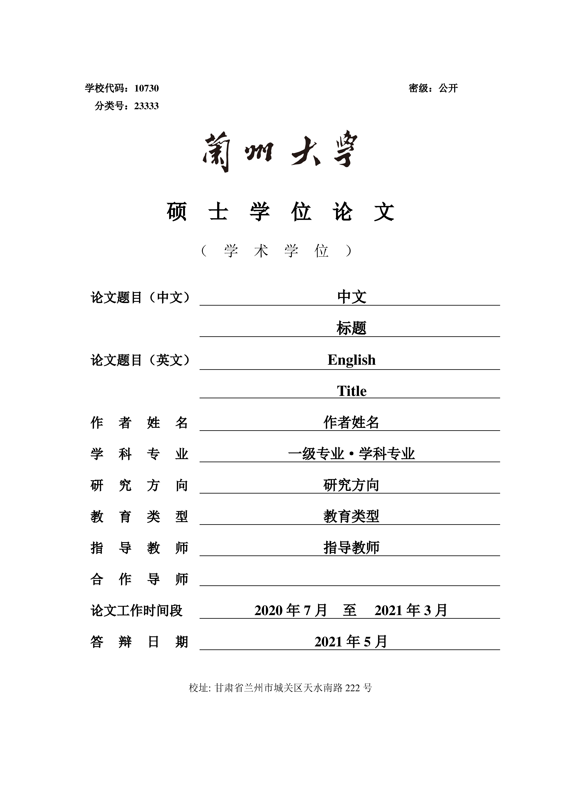
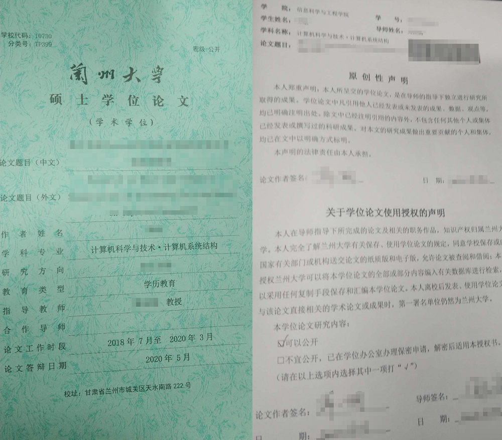

# 兰州大学硕士（博士）学位论文 Latex 模板 beta 0.1

This project is a fork from [LZUThesis2020](https://github.com/yuhlzu/LZUThesis2020)

此项目更具官方模板调整了部分参数，基本与官方word文件保持一致。
Latex项目具体问题参照原链接

模板样式

参照论文终版样式

## 更新内容

* 1.封面内容：
    * 增加了 “学校代码”，“密级” 和 “分类号”。
    * 调整了标题内容与间距。
    * 修改了教育类型等子项，修改了校址使符合最终形式。
* 2.原创性声明：
    * 修改了原创性声明使之符合标准。
    * 图示中条形码为最终入档时添加，论文提交时不需要。
* 3.章节
    * 修改了章节一级标题上边距，使之契合word格式
    * 增加了 “在学期间的研究成果” 页面。
* 4.内容
    * 删除了原论文中的教学部分，使之尽量紧凑。

